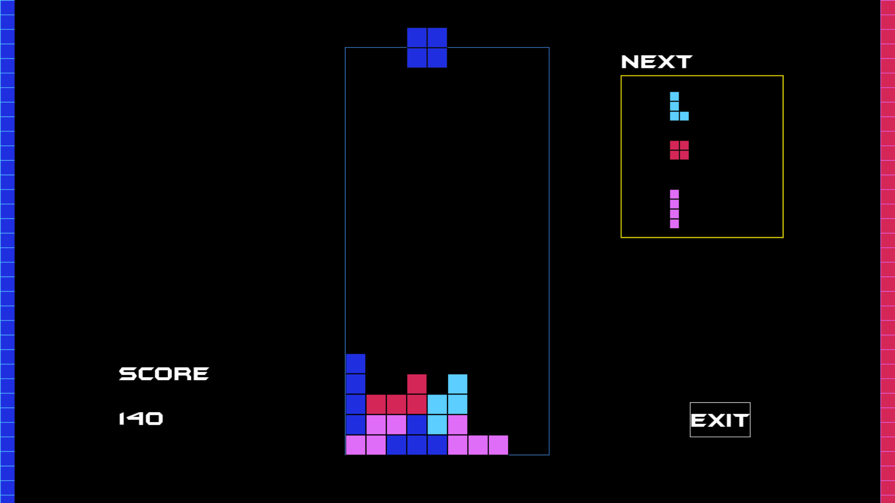

<h1>Tetris game in python</h1>
<p>
  Made a clone of tetris in python using pygame library.<br>
  You can clone this repo and run main.py file.
  
  HTTPS cloning:
  ```
https://github.com/AnandSrikumar/PyTetris.git
  ```

  SSH cloning (You can add an SSH key to clone via SSH <a href="https://github.com/settings/ssh/new">here</a>):
  ```
git@github.com:AnandSrikumar/PyTetris.git
  ```

Github CLI:
  ```
gh repo clone AnandSrikumar/PyTetris
  ```
  <br><br>
</p>

<p>The shapes are made using pygame rect.</p>

<p>
  This has been developed by <a href="https://github.com/AnandSrikumar">AnandSrikumar</a><br>
  Maintainer: <a href="https://github.com/AnandSrikumar">AnandSrikumar</a>
</p>